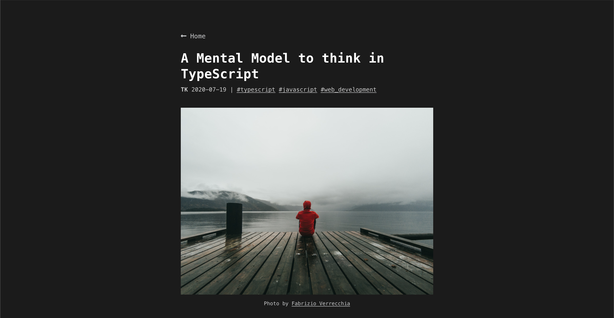

# A Mental Model to think in TypeScript

## Motivation

I came across this tweet from @larimaza.

So I wrote a new blog post to understand TypeScript from zero.

This tech talk is based on this post.
