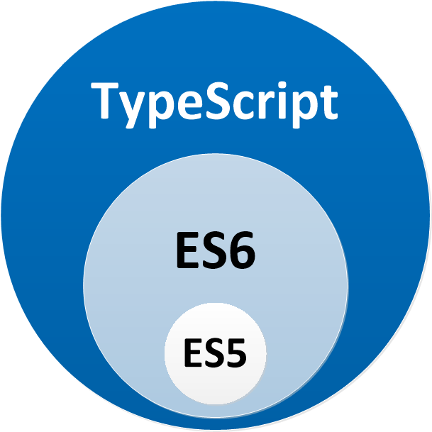

# TypeScript

> Typed JavaScript at Any Scale.

TypeScript is an open-source language which builds on JavaScript by adding static type definitions. Types provide a way to describe the shape of an object, providing better documentation, and allowing TypeScript to validate that your code is working correctly.

It's a superset of JavaScript.

- Types
- Annotation (or decorators)
- Ecosystem
